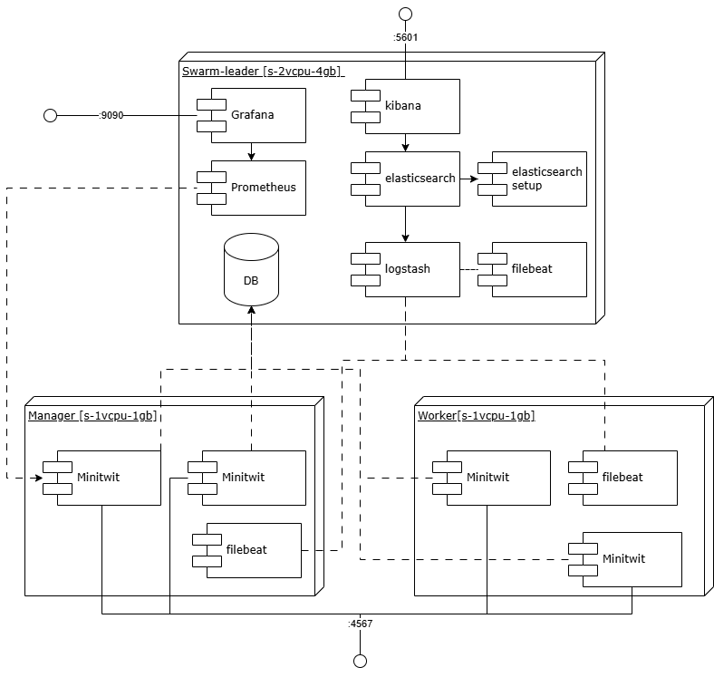
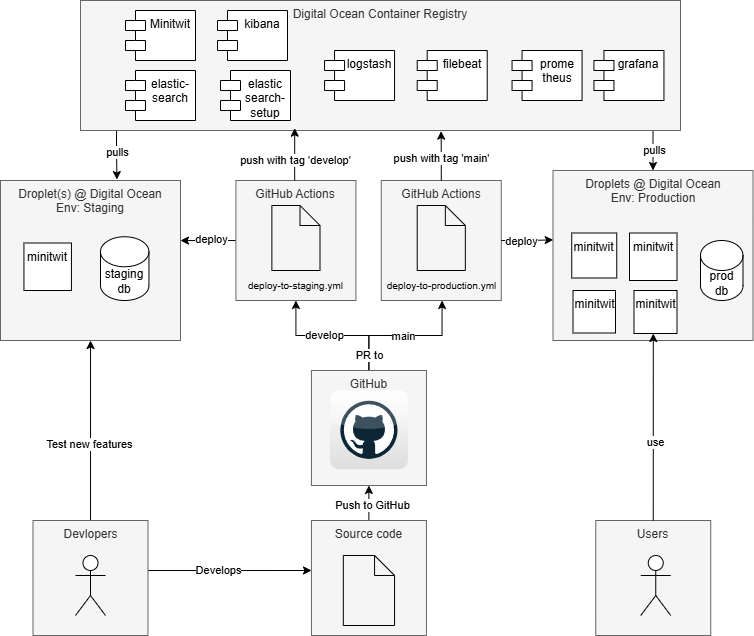

# ITU MiniTwit - A DevOps Education Project
ITU MiniTwit is a lightweight Twitter clone developed for the DevOps course at IT University of Copenhagen. This project demonstrates modern software development practices with a focus on DevOps principles, continuous integration/deployment, and infrastructure automation.

The application is built using Ruby with Sinatra, backed by PostgreSQL, and features a complete CI/CD pipeline with automated testing and deployment. The system architecture utilizes Docker containers orchestrated with Docker Compose, with deployments managed through GitHub Actions to Digital Ocean infrastructure.

MiniTwit provides core social media functionality including user registration, authentication, message posting, and following other users. The application exposes both HTML endpoints for browser interaction and JSON API endpoints for programmatic access.

This project serves as a practical example of DevOps best practices including infrastructure as code, monitoring, logging, and automated testing while maintaining a well-documented codebase with thorough deployment instructions.


## TOC

- [Overview](./docs/overview.md)  
- [Architecture](./docs/architecture.md)  
- [Deployment](./docs/deployment.md)  
- [Development](./docs/development.md)  
- [Monitoring+logging](./docs/monitoring-logging.md)  
- [Testing](./docs/testing.md)  
- [Workflows](./docs/workflows.md)
- [Environment Variables](./environment-variables.md)  


## Project Architecture



## Deployment Flow


<!--## Setup & Run:

*NOT RECOMMENDED - USE DOCKER INSTEAD*

- Install Ruby version 3.3
- Setup .env file (Copy .env.example)
- Setup postgres (Add postgres credentials to the .env file)
- `bundle install` to install packages
- `sh control.sh init` to init db.
- `ruby minitwit.rb` to run program.-->

## How to run locally

To start up all docker services:

`docker compose -f docker-compose.dev.yml up -d`

After this, the minitwit application will be avaible at http://localhost:4567/.

To run a specific service:

`docker compose -f docker-compose.dev.yml up <service_name> -d`

To run the tests:

`docker compose -f docker-compose.testing.yml up --abort-on-container-exit --exit-code-from test`

To stop and delete running containers:

`docker compose -f docker-compose.dev.yml down`

To stop and delete a specific container:

`docker compose -f docker-compose.dev.yml down <service_name>`

To clean up volumes afterwards: (***WARNING:*** deletes all persisted project data)

`docker compose -f docker-compose.dev.yml down --volumes`

## Testing
All tests are performed using RSpec, which is a great DSL for expressing tests. To add tests, use `spec/minitwit_spec.rb` as inspiration. Add `XXXX_spec.rb` to the `spec/` folder, import `spec_helper`, and write as many tests as you should require.

## Developing erb files

The `.erb` files are in folder `templates/`

read more about the erb syntax [here](https://www.puppet.com/docs/puppet/5.5/lang_template_erb.html)

The css file is in the `public/stylesheets` folder.

The erb structure and syntax
```erb
<%# Non-printing tag ↓ -%>
<% if @keys_enable -%>
<%# Expression-printing tag ↓ -%>
keys <%= @keys_file %>
<% unless @keys_trusted.empty? -%>
trustedkey <%= @keys_trusted.join(' ') %>
<% end -%>
<% if @keys_requestkey != '' -%>
requestkey <%= @keys_requestkey %>
<% end -%>
<% if @keys_controlkey != '' -%>
controlkey <%= @keys_controlkey %>
<% end -%>

<% end -%>
``` 

## Endpoints
`:username` in a route means it is a dynamic route parameter - this means `:username` is placeholder for a real username.
E.g the username `nicra` - the route `/nicra` would show the profile of `nicra`

**Note**:   
You should place route with dynamic route parameters in the buttom of files, because the routes are evaluated from top to bottom.
e.g. /:username would match /login or /logout

### Minitwit endpoints (returns html)
| Endpoint             | Method       | Description                |
|----------------------|------------- |----------------------------|
| `/`                  | `GET`        | Root/Home page. Shows timeline.             |
| `/login`             | `GET, POST`  | User login                 |
| `/register`          | `GET, POST`  | User registration          |
| `/logout`            | `GET`        | User logout                |
| `/public`            | `GET`        | Displays the latest messages of all users.       |
| `/:username/follow`  | `GET`        | Follow a user              |
| `/:username/unfollow`| `GET`        | Unfollow a user            |
| `/add_message`       | `POST`       | Add a new message          |
| `/:username`         | `GET`        | View user profile/messages |


### Api Endpoints (GET returns JSON and POST status code)

| Endpoint             | Method       | Description                |
|----------------------|------------- |----------------------------|
| `/msgs`              | `GET`        | Get public messages        |
| `/msgs/:username`    | `GET, POST`  | GET: Public messages for a specific user. POST: post a new message for a specific username.                 |
| `/fllws/:username`   | `GET, POST`  | GET: Returns a list of users whom the given user follows. POST: Allows a user to follow or unfollow another user                 |
| `/latest`            | `GET`  | Retrieves the latest processed command ID                 |
| `/register`            | `POST`  | Create a new user               |


## Database

### Migrations

For more information go to [sequel documentation](https://sequel.jeremyevans.net/documentation.html)
We have created a folder `migrations/` that contains the database changes

For development: `manage_migrations_dev.rb` used in `docker-compose.dev.yml`
For production: `manage_migrations.rb`used in `docker-compose.yml`

This creates a migration of the current database, in this way you can see if the migrations have been applied to the database
This should be run inside the docker container (run Interactive Development 1. and then maybe CTRL+C)

```bash
sequel -d <DB_URL> 
```

### Setup
Create and run a PostgreSQL docker container:
`docker run --name minitwit-postgres --network=minitwit -e POSTGRES_PASSWORD=postgres -d -p 5432:5432 postgres`

Restoring from a dump file:
```
docker exec -it minitwit-postgres /bin/bash
psql -U postgres -d minitwit -f minitwit_db.sql

```

Creating a dump file:
`docker exec minitwit-postgres pg_dump -U postgres -F t postgres > db_dump.sql`

### ORM
The Ruby application communicates with the PostgreSQL database through the [Sequel](https://sequel.jeremyevans.net/) ORM, which handles the database connection, manages the connection pool, and provides an abstraction for executing SQL queries and mapping their results to Ruby objects.

### Methods
| Method               |Parameters                 | Returns       | Description                |
|----------------------|---------------------------|---------------|----------------------------|
| `get_user_id`        | username: string          |`user_id`/`nil`| get user_id from username|

### Helper methods
| Method               |Parameters      | Returns      | Description                |
|----------------------|----------------|------------- |----------------------------|
| `generate_pw_hash`   | password       |`hashed_password`| Generate hashed password|
| `update_latest`      | params         | void          | update latest command ID |
| `format_datetime`    | timestamp      | `formatted_time` | Formats datetime to 'Y-m-d @ H:M'|
| `gravatar_url`       | email, size=80 | `url_to_image` | generate the url to image |

## Release

Releases are done automatically by Github Actions.  
The release version is determined by the contents of the last commit message, for every push on main (which will be the merge commit).  
- If you include `#major` in the commit message, it will bump the major version for the release.
- If you include `#minor` in the commit message, it will bump the minor version for the release.
- If you include `#patch` in the commit message, it will bump the patch version for the release.
- If you include `#none` in the commit message, **no release will be done**.
- Otherwise, if you don't include any of the above options, the *minor* version will be bumped by default.

## Monitoring

Monitoring is implemented using Prometheus + Grafana.

Go to http://localhost:3000/ to see the dashboard.

Config is stored in yaml and json files, under the folder ./grafana.

Currently configured metrics:

- HTTP response count by status codes
- HTTP error response count
- Latency percentiles
- Average latency
- Total registered users

Currently configured alerts:

- Email alerting when 5XX (server-side) error count exceeds the threshold, on the "HTTP error response count" panel

### How to modify dashboard/metrics:

1. Go to the dashboard on the monitoring interface, make changes. You can add, remove or change panels.
2. You cannot save changes from the UI. Export the whole dashboard as json, and overwrite [this](./grafana/predefined-dashboards/minitwit_dashboard.json) file.
3. Restart the grafana docker container.

### How to add new alert rules:

1. Go to the dashboard, select the panel you want to add alerts to.
2. Create and save alert.
3. Export as json (only way to make it permanent). Copy only the relevant alert group under section "groups". 
4. Save it under [this](./grafana/alerting/alert_rules.yaml) file (append it to section "groups").
5. Restart the grafana docker container.

### How to modify alert rules:

1. Go to the dashboard, select the panel, then the existing alert rule.
2. Select "Export with modifications".
3. Make changes, then export as json.
4. Save it under the relevant file, as discussed before.
5. Restart the grafana docker container.

## Logging

Logging is implemented using the ELFK stack (Elasticsearch, Logstash, Filebeat, Kibana).

Go to http://localhost:5601/ to see the kibana UI.

First time startup:
1. Run ```docker compose -f docker-compose.dev.yml up elasticsearch-setup```. This configures the necessary users and roles for Elasticsearch and the stack.
2. Run the stack normally.
3. On the Kibana UI, click on Analytics/Discover to create the initial data view.

The following fields are the most relevant for filtering logs:
- service: the name of the docker service, as defined in the docker compose file.
- level: the logging level (DEBUG, INFO etc.) if applicable. If a log could not be parsed by Logstash, this field is omitted.
- @timestamp

Config files are stored under ./elk.

Logstash filtering logic can be changed in [this](./elk/logstash/pipeline/logstash.conf) file.

## Deployment
We use Vagrant to provision a droplet to Digital Ocean. For this to work, a few configuration steps must be taken. The github workflows refer to the reserved IPs, so after provisioning, you need to assign these IPs to the droplets.

Before starting, you are required to have an [ssh-key](https://docs.github.com/en/authentication/connecting-to-github-with-ssh/generating-a-new-ssh-key-and-adding-it-to-the-ssh-agent) and a [digital ocean token](https://docs.digitalocean.com/reference/api/create-personal-access-token/), with access to the container registry & droplets. Likewise, you are required to have the PROFESSIONAL plan of container registry at Digital Ocean. Add your SSH key to DO, such that it knows your key.


### PREPARE FOR DEPLOYMENT
1. Add following variables to your bash/zsh environment (Or simply run them)
```bash
export DIGITAL_OCEAN_TOKEN="your-generated-token"
export SSH_KEY_NAME="name-of-your-ssh-key-in-DO" # DO > settings > security > name
export SSH_PRIVATE_KEY_PATH="private-ssh-key-path"
```
2. Add your public SSH key to `remote_files/authorized_keys`
3. Adjust env variables in `.github/workflows/deploy-to-XXXX.yml`
4. Add secrets to Github, to allow Github Actions to operate on Digital Ocean resources. Specifically add a secret `DIGITALOCEAN_ACCESS_TOKEN` and `SSH_KEY`. The access token requires access to the read/write to the container registry. The SSH_KEY is the private key of some private/public key, that must also be included in `remote_files/authorized_keys`. This should preferably be an isolated key, not available on private machines.
5. Install [vagrant](https://developer.hashicorp.com/vagrant/install)
6. Add DO vagrant plugin `vagrant plugin install vagrant-digitalocean`

### COMMANDS:
- `vagrant up` - Spin up instance
- `vagrant destroy` - Destroy current instance
- `doctl compute ssh app-name` - SSH into instance. default app-name is `minitwit`. [Install doctl here](https://docs.digitalocean.com/reference/doctl/how-to/install/)

If you want to run a specific vagrant file, you can specify it by setting the `VAGRANT_VAGRANTFILE` env variable. E.g.:
```bash
VAGRANT_VAGRANTFILE=VagrantfileStaging vagrant up --provider=digital_ocean
```

### Auto deployment
The `deploy-to-XXX.yml` file is setup to trigger an automatic deployment. Ensure that you have set up the correct env variables and secrets as explained in section `PREPARE FOR DEPLOYMENT`.

After this, every push should successfully build, test and deploy the application. Pushes to develop trigger deploy to the staging, and pushes to main trigger deploy to the prod environment. 

### Other observations 
- Hashing sha256
- Opens and closes db connection for each request
- Flagging system. 
- time: Unix seconds
- Requests return HTML


### Linters
Currently there are 3 linters used for this project, which are the following:
- [Standard Ruby linter](https://github.com/standardrb/standard)
- [ERB linter](https://github.com/Shopify/erb_lint)
- [Dockerfile linter](https://github.com/hadolint/hadolint)


## Compile flag tool
```bash
gcc flag_tool.c -o flag_tool -lsqlite3
```
