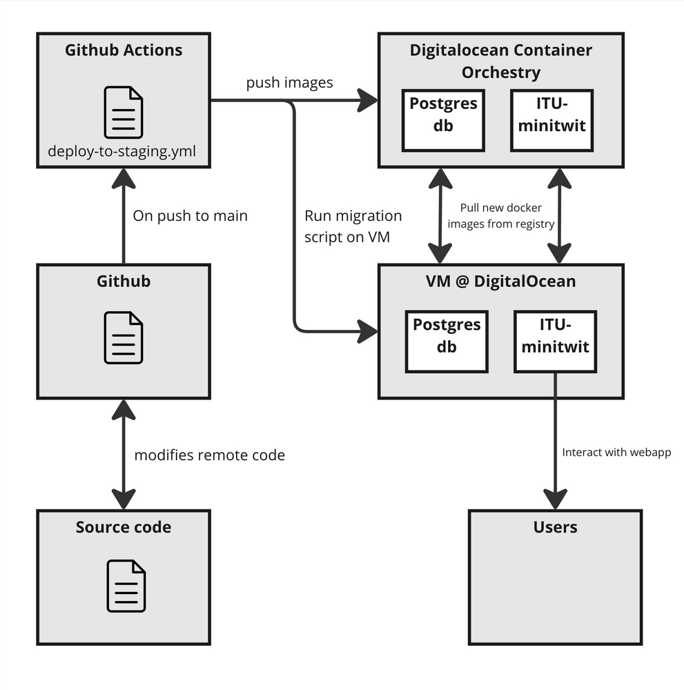

# itu-minitwit

## Project architecture



## Setup & Run:
*NOT RECOMMENDED - USE DOCKER INSTEAD*

- Install Ruby version 3.3
- Setup .env file (Copy .env.example)
- Setup postgres (Add postgres credentials to the .env file)
- `bundle install` to install packages
- `sh control.sh init` to init db.
- `ruby minitwit.rb` to run program.

## Run using Docker

`docker compose up -d`

### Interactive development

1. `docker compose -f docker-compose.dev.yml run --rm --service-ports dev bash`
2. Run `rspec` to test or `ruby minitwit.rb` to start the app.

Clean up database afterwards:
`docker compose -f docker-compose.dev.yml down --volumes`

## Testing
All tests are performed using RSpec, which is a great DSL for expressing tests. To add tests, use `spec/minitwit_spec.rb` as inspiration. Add `XXXX_spec.rb` to the `spec/` folder, import `spec_helper`, and write as many tests as you should require.

## developing erb files

The `.erb` files are in folder `templates/`

read more about the erb syntax [here](https://www.puppet.com/docs/puppet/5.5/lang_template_erb.html)

The css file is in the `public/stylesheets` folder.

The erb structure and syntax
```erb
<%# Non-printing tag ↓ -%>
<% if @keys_enable -%>
<%# Expression-printing tag ↓ -%>
keys <%= @keys_file %>
<% unless @keys_trusted.empty? -%>
trustedkey <%= @keys_trusted.join(' ') %>
<% end -%>
<% if @keys_requestkey != '' -%>
requestkey <%= @keys_requestkey %>
<% end -%>
<% if @keys_controlkey != '' -%>
controlkey <%= @keys_controlkey %>
<% end -%>

<% end -%>
``` 

## Endpoints
`:username` in a route means it is a dynamic route parameter - this means `:username` is placeholder for a real username.
E.g the username `nicra` - the route `/nicra` would show the profile of `nicra`

**Note**:   
You should place route with dynamic route parameters in the buttom of files, because the routes are evaluated from top to bottom.
e.g. /:username would match /login or /logout

### Minitwit endpoints (returns html)
| Endpoint             | Method       | Description                |
|----------------------|------------- |----------------------------|
| `/`                  | `GET`        | Root/Home page. Shows timeline.             |
| `/login`             | `GET, POST`  | User login                 |
| `/register`          | `GET, POST`  | User registration          |
| `/logout`            | `GET`        | User logout                |
| `/public`            | `GET`        | Displays the latest messages of all users.       |
| `/:username/follow`  | `GET`        | Follow a user              |
| `/:username/unfollow`| `GET`        | Unfollow a user            |
| `/add_message`       | `POST`       | Add a new message          |
| `/:username`         | `GET`        | View user profile/messages |


### Api Endpoints (GET returns JSON and POST status code)

| Endpoint             | Method       | Description                |
|----------------------|------------- |----------------------------|
| `/msgs`              | `GET`        | Get public messages        |
| `/msgs/:username`    | `GET, POST`  | GET: Public messages for a specific user. POST: post a new message for a specific username.                 |
| `/fllws/:username`   | `GET, POST`  | GET: Returns a list of users whom the given user follows. POST: Allows a user to follow or unfollow another user                 |
| `/latest`            | `GET`  | Retrieves the latest processed command ID                 |
| `/illegal-route'`    | `POST`  | Request validation check, if from simulator or not                |


## Database

### Setup
Create and run a Postgresql docker container:
`docker run --name minitwit-postgres --network=minitwit -e POSTGRES_PASSWORD=postgres -d -p 5432:5432 postgres`

Restoring from a dump file:
```
docker exec -it minitwit-postgres /bin/bash
psql -U postgres -d minitwit -f minitwit_db.sql

```

Creating a dump file:
`docker exec minitwit-postgres pg_dump -U postgres -F t postgres > db_dump.sql`


### Methods
| Method               |Parameters                 | Returns       | Description                |
|----------------------|---------------------------|---------------|----------------------------|
| `connect_db`         | None                      |`db`           | Connect to db |
| `init_db`            | None                      | void          | init database|
| `query_db`           | query, args=[], one=false |`results`      | query the database|
| `get_user_id`        | username: string          |`user_id`/`nil`| get user_id from username|

### Helper methods
| Method               |Parameters      | Returns      | Description                |
|----------------------|----------------|------------- |----------------------------|
| `generate_pw_hash`   | password       |`hashed_password`| Generate hashed password|
| `update_latest`      | params         | void          | update latest command ID |
| `format_datetime`    | timestamp      | `formatted_time` | Formats datetime to 'Y-m-d @ H:M'|
| `gravatar_url`       | email, size=80 | `url_to_image` | generate the url to image |


## Deployment
We use Vagrant to deploy an instance to Digital Ocean. For this to work, a few configuration steps must be taken. Once instantiated, the github workflows must be adjusted in accordance.

Before starting, you are required to have an [ssh-key](https://docs.github.com/en/authentication/connecting-to-github-with-ssh/generating-a-new-ssh-key-and-adding-it-to-the-ssh-agent) and a [digital ocean token](https://docs.digitalocean.com/reference/api/create-personal-access-token/), with access to the container registry & droplets. Likewise, you are required to have at least the BASIS plan of container registry at Digital Ocean. Add your SSH key to DO, such that it knows your key.


### PREPARE FOR DEPLOYMENT
1. Add following variables to your bash/zsh environment (Or simply run them)
```bash
export DIGITAL_OCEAN_TOKEN="your-generated-token"
export SSH_KEY_NAME="name-of-your-ssh-key-in-DO" # DO > settings > security > name
export SSH_PRIVATE_KEY_PATH="private-ssh-key-path"
```
2. Add your public SSH key to `remote_files/authorized_keys`
3. Adjust env variables in `.github/workflows/deploy-to-XXXX.yml`
4. Add secrets to Github, to allow Github Actions to operate on Digital Ocean resources. Specifically add a secret `DIGITALOCEAN_ACCESS_TOKEN` and `SSH_KEY`. The access token requires access to the read/write to the container registry. The SSH_KEY is the private key of some private/public key, that must also be included in `remote_files/authorized_keys`. This should preferably be an isolated key, not available on private machines.
5. Install [vagrant](https://developer.hashicorp.com/vagrant/install)
6. Add DO vagrant plugin `vagrant plugin install vagrant-digitalocean`

### COMMANDS:
- `vagrant up` - Spin up instance
- `vagrant destroy` - Destroy current instance
- `doctl compute ssh app-name` - SSH into instance. default app-name is `minitwit`. [Install doctl here](https://docs.digitalocean.com/reference/doctl/how-to/install/)

### Auto deployment
The `deploy-to-XXX.yml` file is setup to trigger an automatic deployment. Ensure that you have set up the correct env variables and secrets as explained in section `PREPARE FOR DEPLOYMENT`. *Remember to specify which branch you want the action to be triggered by*.

After this, every push should successfully build, test and deploy the application.

### Other observations 
- Hashing sha256
- Opens and closes db connection for each request
- Flagging system. 
- time: Unix seconds
- Requests return HTML


## Compile flag tool
```bash
gcc flag_tool.c -o flag_tool -lsqlite3
```
