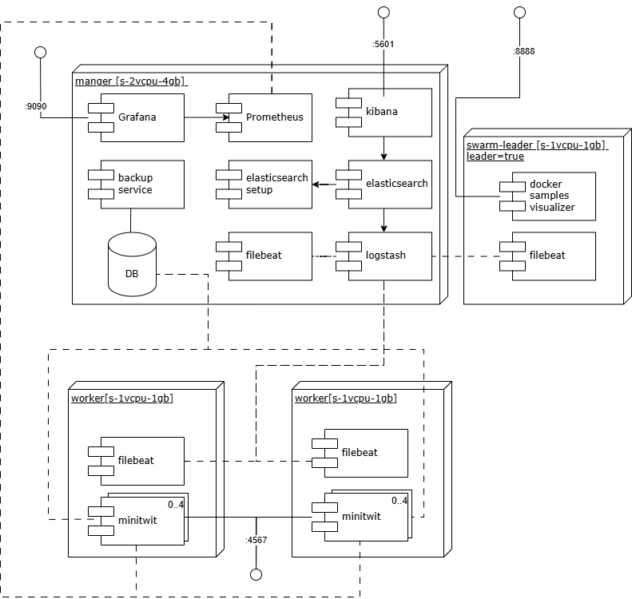
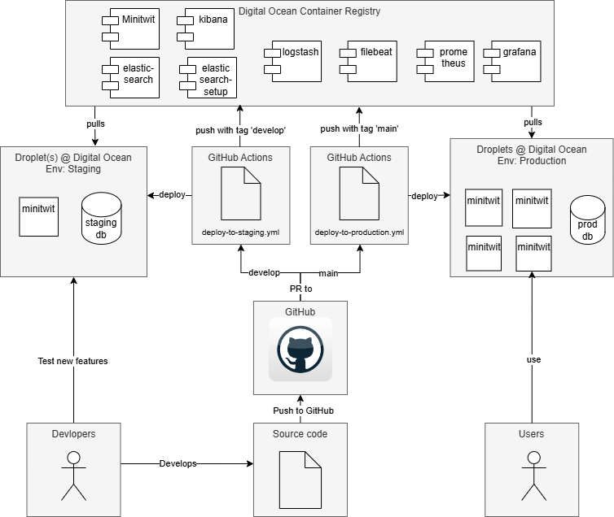
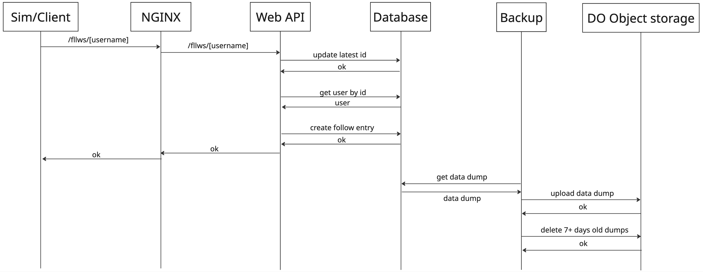
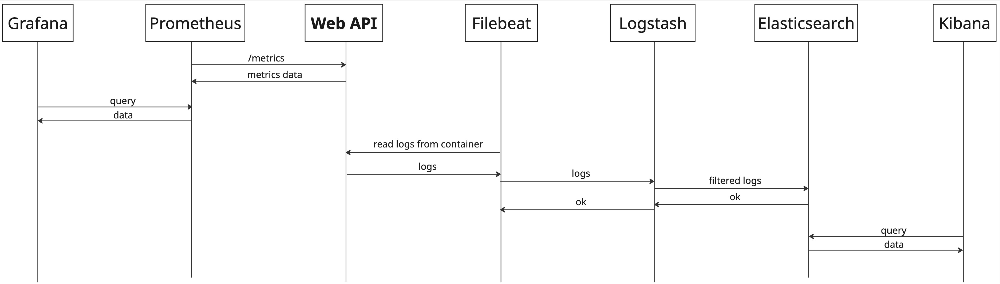
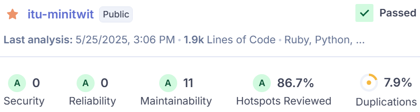

# System

## Design and architecture of the _ITU-MiniTwit_ systems

The current achitecture of the minitwit system. The ideal architecture can be found in the appendix.

The current deployment flow:

## All dependencies of _ITU-MiniTwit_
### Application
| Tech/Tool | Description |
| ----| ----- |
| Ruby |  Programming language |
| Sinatra | Lightweight Ruby web framework for building simple web applications |
| Sequel |  Ruby Database ORM |
| pg | Ruby PostgreSQL library  |
| digest |  For md5 and sha2  |
| json | For json manipulation   |
| dotenv | To work with the .env file  |
| rack |  Defines a standard way for Ruby web frameworks and web servers to communicate |
| prometheus/middleware/exporter |  Prometheus Ruby client to expose metrics to Prometheus |
| active_support/time | Powerful time-related extensions to `Time` and `Date` |

### Database
|Tech/Tool| Description|
|----| ----|
| PostgreSQL | The database management system |
| eeshugerman/postgres-backup-s3:15 | To automate PostgreSQL database backups and upload them to  S3 using PostgreSQL |

### Testing, Linting and Static Analysis

| Tech/Tool         | Description |
|-------------------|-------------------------|
| Python            | Programming language |
| requests          | Python library for making HTTP requests|
| Playwright        | End-to-end testing framework for web apps |
| pytest            | Popular Python testing framework for writing simple tests |
| rspec             | Ruby testing framework focused on behavior-driven development |
| SonarQube         | Static code analysis tool to measure code quality |
| standardrb/standard | Ruby file linter |
| hadolint/hadolint | Dockerfile linter |
| erb_lint          | ERB (Embedded Ruby) template linter  |

### Deployment

| Tech/Tool               | Description  |
|---------------------    |--------------|
| ubuntu                  | Popular open-source Linux distribution  |
| NGINX                   | High-performance web server and reverse proxy server |
| Docker                  | Platform for developing, shipping, and running applications as containers  |
| GitHub                  | Cloud-based platform for hosting and managing Git repositories        |
| GitHub Actions          | CI/CD service by GitHub for automating workflows like testing and deployment |
| GitHub Secrets          | Secure way to store and manage sensitive information (e.g., API keys) in GitHub workflows |
| Vagrant                 | Tool for managing and provisioning virtual machine environments using simple configurations |
| Terraform               | Infrastructure as Code (IaC) tool for automating cloud infrastructure provisioning |
| Digital Ocean (DO)           | Cloud service provider offering scalable computing resources and services |
| DO Container Registry   | Service to store and manage Docker images                        |
| DO object Storage (S3)  | Object storage service, similar to AWS S3, for storing files and backups   |

### Monitoring + Logging
| Tech/Tool     | Description                                                                 |
|---------------|-----------------|
| Elasticsearch | Distributed search and analytics engine used for indexing and querying logs, metrics |
| Logstash      | Data processing pipeline tool that collects, transforms, and forwards data to Elasticsearch |
| Filebeat      | Lightweight logshipper for forwarding and centralizing log data to Logstash or Elasticsearch |
| Kibana        | Data visualization and exploration tool tailored for Elasticsearch, used for dashboards and log analysis |
| Prometheus    | Open-source monitoring and alerting toolkit designed for metrics collection |
| Grafana       | Visualization tool used to create dashboards from time-series data like Prometheus metrics |

## Important interactions of subsystems
Both the simulator and client contact the same API application, so both sequence diagrams look identical. The following sequence diagram uses the simulator request endpoint `/fllws/[username]` as the baseline. The following sequence diagrams do not take Docker Swarm into account, as the underlying communication is hidden.

For monitoring and logging, we have also included a sequence diagram to show how they interact with each other.

## Current state of the system based on static analysis
At the current state of the project all major functionalities are implemented and out on production with only a few minor issues remaining, which are listed on the Github repository's Issues page [here](https://github.com/DevOps-Sad-people/itu-minitwit/issues). 
   
Throughout development we also used static analysis tools such as SonarQube and CodeClimate to ensure code quality. The quality assessment reported by SonarQube can be seen on the image below:   

   
We managed to avoid/solve *Security* and *Reliablity* issues, and the remaining *Maintainability* issues are mainly "multiple string literals" problems, which we deemed non-crucial. Code duplication was also kept at minimal, coming in at 7.9% for the the entire codebase (*Note: source code provided by the course, such as the flag_tool or the simulator was excluded from the quality assessment*).

##  Arguments for the technology choices

### Programming language and framework

We considered several programming languages and frameworks for the API application, including C# with Razor-Pages, Ruby with Sinatra, and Go with Gorilla. We chose Ruby + Sinatra because of the readability and learnability. More in Appendix.

### Database

We went with PostgreSQL. Both MySQL and PostgreSQL are great options for our purpose - familiarity with PostgreSQL and it being open-source motivated our choice. More in appendix.

### Virtualization techniques and deployment targets

**Containerization and virtualization**

We have chosen Docker to containerize our applications, as it allows us to create lightweight, reproducible environments, packaging all necessary dependencies together, making development, testing and deployment all easier.

For virtualization, on our staging environment, we use Vagrant to provision VMs as it allows us to set up and configure reproducible machines from code.

**More advanced Infrastructure as Code (Terraform)**

We use Terraform instead of Vagrant for our production environment because it is flexible and more powerful, allowing us to manage our infrastructure as code across multiple droplets. Vagrant is used for staging because it provides a simpler setup, allowing us to quickly spin up and tear down instances as needed.

**Hosting: Digital Ocean vs AWS/Microsoft Azure**

They both offer rental of VMs. We chose Digital Ocean as our cloud provider mainly because of its simplicity and great tooling. Because of the simplicity we can focus on everything else, rather than learning how a complex tool works. Pros and cons found in Appendix.

### CI/CD system

We have chosen Github Actions as they offer a free, scalable, and secure CI/CD solution with seamless GitHub integration, customizable YAML workflows, reusable actions, multi-platform support, and efficient automation through parallel execution and event-driven triggers. More about the advantages in the Appendix.

### Testing (Unit, UI, E2E)

**Minitest vs Rspec**

We chose RSpec, as we are prioritizing readable and maintainable technologies. It is also a very popular and large toolkit, which is great for testing.

**Selenium vs Playwright**

Playwright is a fast, open-source browser automation tool backed by Microsoft that launches browsers quickly, runs tests in parallel, and uses optimized headless mode for faster execution than Selenium. It supports Chromium, Firefox, and WebKit natively, auto-waits for elements to reduce flakiness, and uses a persistent WebSocket connection instead of Selenium’s HTTP-based WebDriver. We tried to implement both Selenium and Playwright. For us it was impossible to get Selenium to work as we had critical problems with the external browser drivers needed for the Selenium framework to work. Playwright did not need external drivers since it has built-in protocol clients; it was also easy to setup and use for developing new UI tests. 

### Monitoring and Logging

For monitoring we chose **Prometheus** and **Grafana** as our stack.
For logging we went with the **ELFK** stack.
More in the appendix.
