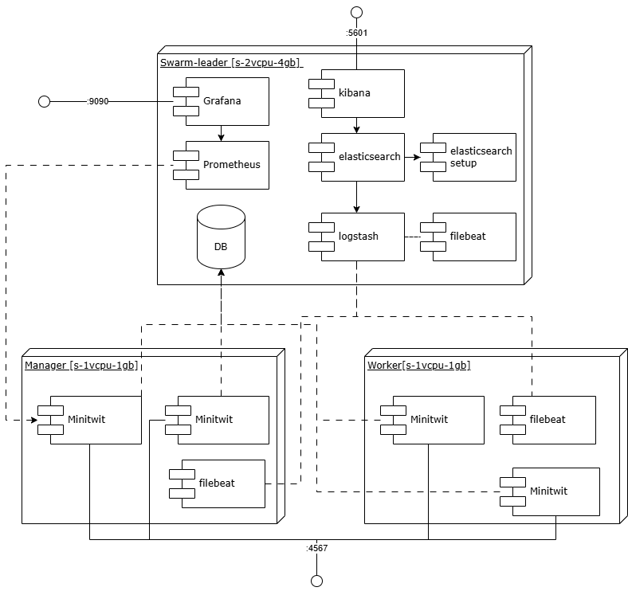

# System

A description and illustration of the:

## [ seb/nick ] Design and architecture of your _ITU-MiniTwit_ systems

The current achitecture of the minitwit system.

The current deployment flow.

## [Nic] All dependencies of your _ITU-MiniTwit_ systems on all levels of abstraction and development stages. That is, list and briefly describe all technologies and tools you applied and depend on.

## [Nic] Important interactions of subsystems.
Both the simulator and client contact the same API application, so both sequence diagrams look identical. The following sequence diagram uses the simulator request endpoint `/fllws/[username]` as the baseline. The following sequence diagrams does not take Docker Swarm into account, as the underlying communication is hidden.

For monitoring and logging, we have also included a sequence diagram to show how they interact with each other.

## [G] Describe the current state of your systems, for example using results of static analysis and quality assessments.

## [ALL] MSc students should argue for the choice of technologies and decisions for at least all cases for which we asked you to do so in the tasks at the end of each session.

