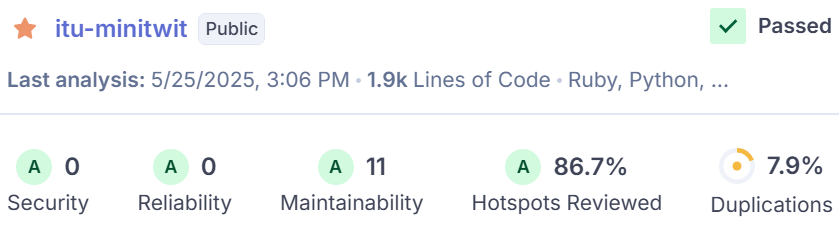

# System

A description and illustration of the:

## [ seb/nick ] Design and architecture of your _ITU-MiniTwit_ systems

The current achitecture of the minitwit system. The ideal architecture can be found in the appendix. 

The current deployment flow.

## [Nic] All dependencies of your _ITU-MiniTwit_ systems on all levels of abstraction and development stages. That is, list and briefly describe all technologies and tools you applied and depend on.

## [Nic] Important interactions of subsystems.
Both the simulator and client contact the same API application, so both sequence diagrams look identical. The following sequence diagram uses the simulator request endpoint `/fllws/[username]` as the baseline. The following sequence diagrams does not take Docker Swarm into account, as the underlying communication is hidden.

For monitoring and logging, we have also included a sequence diagram to show how they interact with each other.

## [G] Describe the current state of your systems, for example using results of static analysis and quality assessments.
At the current state of the project all major functionalities are implemented and out on production with only a few minor issues remaining, which are listed on the Github repository's Issues page [here](https://github.com/DevOps-Sad-people/itu-minitwit/issues). 
   
Throughout development we also used static analysis tools such as SonarQube and CodeClimate to ensure code quality. The quality assessment reported by SonarQube can be seen on the image below:   

   
We managed to avoid/solve *Security* and *Reliablity* issues, and the remaining *Maintainability* issues mainly included "multiple string literals" problems, which we deemed non-crucial. Code duplication was also kept at minimal, coming in at 7.9% for the the entire codebase (*Note: source code provided by the course, such as the flag_tool or the simulator was excluded from the quality assessment*).

## [ALL] MSc students should argue for the choice of technologies and decisions for at least all cases for which we asked you to do so in the tasks at the end of each session.

### Programming language and framework
We considered several programming languages and frameworks for the API application, including C# with Razor-Pages, Ruby with Sinatra, and Go with Gorilla. 

### Virtualization techniques and deployment targets

### CI/CD system

We have chosen Github actions they offers a free, scalable, and secure CI/CD solution with seamless GitHub integration, customizable YAML workflows, reusable actions, multi-platform support, and efficient automation through parallel execution and event-driven triggers.

### Database
We went with postgres. Both MySQL and postgres are great options for our purpose - familiarity with postgres and open-sourced tech ruled the choice.

### Testing (UI, E2E)

**Selenium vs Playwright**

We tried to implement both Selenium and Playwright. For us it was impossible to get the Selenium to work, we had critical problems with the external browser drivers needed for the Selenium framework to work. Playwright did not need external dirvers since built in protocol clients and was easy to setup and use to develop new UI test. 

### Static Analysis + Linting

### Hosting (Digital Ocean)

### Monitoring + Logging

### Infrastructure as Code (Terraform)

Vagrant for staging and Terraform for production. We chose Terraform for production because it is powerful and flexible, allowing us to manage our infrastructure as code across multiple droplets. Vagrant is used for staging because it provides a simpler setup, allowing us to quickly spin up and tear down instances as needed.

### old 
## Language and Web Framework
- **C# + Razor-Pages**
  - Familiarity with both the language and framework
  - Big enterprise standard
  - Enterprise-grade software
  - Very popular in Denmark
  - Verbose + A lot of boilerplate
  - Compiled => faster execution
  - Founded by Microsoft (Trustworthy)
- **Ruby + Sinatra**
  - No familiarity
  - **Interesting (to learn new technologies)**
  - Lighter than Go
  - **Very readable & learnable**
  - **Rapid development**
  - Interpreted => Slower
    - Reports of lower scalability
- **Go + Gorilla**
  - Compiled => Faster
  - Great for concurrency
  - Not designed for web applications
    - Reports of longer development time
  - More low-level features (e.g. pointers)
  - DevOps => popular for microservices
  - Founded by Google (Trustworthy)

We chose Ruby + Sinatra because of the readibility and learnability.

It allows us to do rapid development.

We also find it interesting to learn new technologies.

## Testing
- **Minitest**
  - Built-in
  - Often standard in web frameworks
  - Very light and efficient
- **RSpec**
  - Very readable DSL
  - Very popular alternative to minitest
  - Large toolkit

We chose RSpec, as we're prioritizing readable and maintainable technologies. It is also a very popular and large toolkit, which is great for testing!

## Virtualization
- **Docker**
- **Vagrant**

## Deployment
- **Digital Ocean**
  - **focuses on simplicity**
  - **easy to learn CLI/interface**
  - **great tooling**
  - sufficient credits to cover our needs
- **AWS**/**Microsoft Azure**
  - industry leading, popular
  - customizability
  - steeper learning curve
  - more enterprise focused

They both offer rental of VMs.

We chose Digital Ocean because of its simplicity and great tooling.

Because of the simplicity we can focus on everything else, rather than learning how a complex tool works.

## Change of database
- **SQLite**
  - SQLite locks during writes
  - Does not scale as well
  - Great for development
- **MySQL**
  - Simpler feature set
  - Industry standard
  - Great for large amount of reads
  - Oracle owned
- **PostgresQL**
  - Advanced query features
  - Industry standard
  - Open-source

We went with postgres. Both MySQL and postgres are great options for our purpose - familiarity with postgres and open-sourced tech ruled the choice.

## Monitoring
We chose **Prometheus** + **Grafana** for our monitoring stack.

**Prometheus** provides several features which are useful for us:
- centralized, pull-based metric collection
- metrics are time-series based -> can show changes over time
- had ane existing Ruby client library -> easy setup & integration with our system

**Grafana:**
- integrates well with Prometheus
- supports a wide range of metric types
- (relatively) easy to use by writing PromQL queries
- supports alerts (e.g. email)

## Logging
- **ELFK stack - Filebeat + Logstash + Elasticsearch + Kibana**
  - very popular, pretty much industry standard
  - nice interoperability (Kibana is tailored for Elasticsearch)
  - Logstash + Elasticsearch can be very resource-heavy -> Filebeat addresses this with lightweight log collection
- **Grafana + Loki**
  - less resource-heavy
  - could integrate well into our existing Grafana service
  - less popular choice

We chose the ELFK stack mainly because it's the most popular choice, and we wanted to get familiar with it.

## ui testing
Playwright launches browsers faster and runs tests in parallel by default.

Headless mode is optimized, leading to faster execution times compared to Selenium.

Auto-waiting for elements prevents flaky tests, whereas Selenium often requires explicit waits.

Supports multiple browsers out of the box:
Playwright works natively with Chromium, Firefox, and WebKit (Safari engine)

Architecture: Playwright uses a WebSocket connection rather than the WebDriver API and HTTP. This stays open for the duration of the test, so everything is sent on one connection. This is one reason why Playwright’s execution speeds tend to be faster.

History: Playwright is fairly new to the automation scene. It is faster than Selenium and has capabilities that Selenium lacks, but it does not yet have as broad a range of support for browsers/languages or community support. It is open source and [backed by Microsoft](https://github.com/microsoft/playwright).