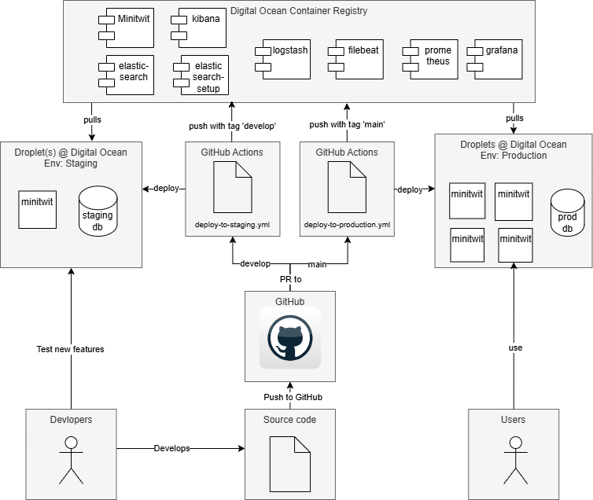
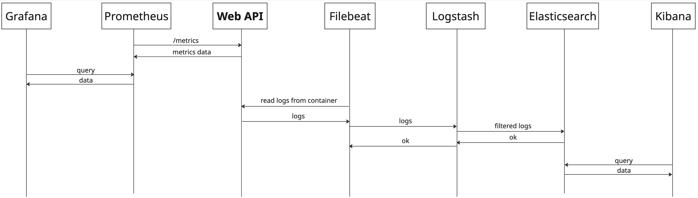

# System

A description and illustration of the:

## [ seb/nick ] Design and architecture of your _ITU-MiniTwit_ systems

The current achitecture of the minitwit system.

The current deployment flow.

## [Nic] All dependencies of your _ITU-MiniTwit_ systems on all levels of abstraction and development stages. That is, list and briefly describe all technologies and tools you applied and depend on.
### Application
| Tech/Tool | Discription |
| ----| ----- |
| Ruby |  Programming language |
| Sinatra | Lightweight Ruby web framework for building simple web applications |
| Sequal |  Ruby Database ORM |
| pg | Ruby PostgreSQL library  |
| digest |  For md5 and sha2  |
| json | For json manipulation   |
| dotenv | To work with the .env file  |
| rack |  Defines a standard way for Ruby web frameworks and web servers to communicate |
| prometheus/middleware/exporter |  Prometheus Ruby client to expose metrics to Prometheus |
| active_support/time | powerful time-related extensions to `Time` and `Date` |

### Database
|Tech/Tool| Discription|
|----| ----|
| PostgresSQL | The database management system |
| eeshugerman/postgres-backup-s3:15 | To automate PostgreSQL database backups and upload them to  S3 using PostgreSQL |

### Testing, Linting and Static Analysis

| Tech/Tool         | Description |
|-------------------|-------------------------|
| Python            | Programming language |
| requests          | Python library for making HTTP requests|
| Playwright        | End-to-end testing framework for web apps |
| pytest            | Popular Python testing framework for writing simple tests. |
| rspec             | Ruby testing framework focused on behavior-driven development |
| SonarQube         | Static code analysis tool to detect bugs, |
| hadolint/hadolint | Linter for Dockerfiles to catch syntax errors |
| erb_lint          | Linter for ERB (Embedded Ruby) templates  |

### Deployment

| Tech/Tool               | Description  |
|---------------------    |--------------|
| ubuntu                  | Popular open-source Linux distribution  |
| NGINX                   | High-performance web server and reverse proxy server |
| Docker                  | Platform for developing, shipping, and running applications in containers.  |
| GitHub                  | Cloud-based platform for hosting and managing Git repositories.        |
| GitHub Actions          | CI/CD service by GitHub for automating workflows like testing and deployment. |
| GitHub Secrets          | Secure way to store and manage sensitive information (e.g., API keys) in GitHub workflows. |
| Vagrant                 | Tool for managing and provisioning virtual machine environments using simple configuration. |
| Terraform               | Infrastructure as Code (IaC) tool for automating cloud infrastructure provisioning. |
| Digital Ocean           | Cloud service provider offering scalable computing resources and services. |
| DO Container Registry   | Service to store and manage Docker container images.                        |
| DO object Storage (S3)  | Object storage service, similar to AWS S3, for storing files and backups.   |

### Monitoring + Logging
| Tech/Tool     | Description                                                                 |
|---------------|-----------------|
| Elasticsearch | Distributed search and analytics engine used for storing and querying logs, metrics |
| Logstash      | Data processing pipeline tool that collects, transforms, and forwards data to Elasticsearch. |
| Filebeat      | Lightweight shipper for forwarding and centralizing log data to Logstash or Elasticsearch. |
| Kibana        | Data visualization and exploration tool for Elasticsearch, used for dashboards and log analysis. |
| Prometheus    | Open-source monitoring and alerting toolkit designed for reliability and metrics collection. |
| Grafana       | Visualization tool used to create dashboards from time-series data like Prometheus metrics. |

## [Nic] Important interactions of subsystems.
Both the simulator and client contact the same API application, so both sequence diagrams look identical. The following sequence diagram uses the simulator request endpoint `/fllws/[username]` as the baseline. The following sequence diagrams does not take Docker Swarm into account, as the underlying communication is hidden.

For monitoring and logging, we have also included a sequence diagram to show how they interact with each other.

## [G] Describe the current state of your systems, for example using results of static analysis and quality assessments.
At the current state of the project all major functionalities are implemented and out on production with only a few minor issues remaining, which are listed on the Github repository's Issues page [here](https://github.com/DevOps-Sad-people/itu-minitwit/issues). 
   
Throughout development we also used static analysis tools such as SonarQube and CodeClimate to ensure code quality. The quality assessment reported by SonarQube can be seen on the image below:   

   
We managed to avoid/solve *Security* and *Reliablity* issues, and the remaining *Maintainability* issues mainly included "multiple string literals" problems, which we deemed non-crucial. Code duplication was also kept at minimal, coming in at 7.9% for the the entire codebase (*Note: source code provided by the course, such as the flag_tool or the simulator was excluded from the quality assessment*).

## [ALL] MSc students should argue for the choice of technologies and decisions for at least all cases for which we asked you to do so in the tasks at the end of each session.

