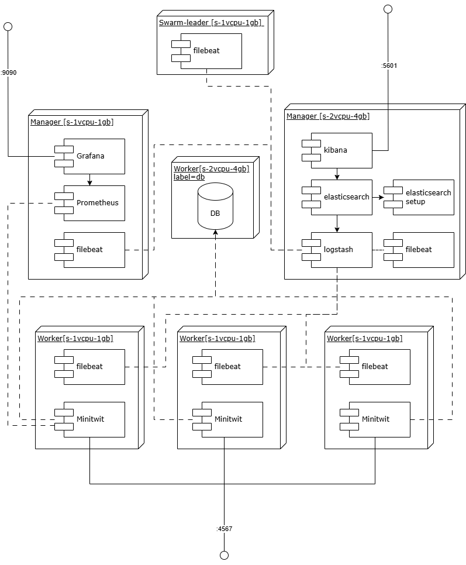

# Appendix

## Ideal Architecture
The ideal architecture with less pressure on the swarm leader node:

## Choosing technologies

### Programming Language and Web Framework
- **C# + Razor-Pages**
  - Familiarity with both the language and framework
  - Big enterprise standard
  - Enterprise-grade software
  - Very popular in Denmark
  - Verbose + A lot of boilerplate
  - Compiled => faster execution
  - Founded by Microsoft (Trustworthy)
- **Ruby + Sinatra**
  - No familiarity
  - **Interesting (to learn new technologies)**
  - Lighter than Go
  - **Very readable & learnable**
  - **Rapid development**
  - Interpreted => Slower
    - Reports of lower scalability
- **Go + Gorilla**
  - Compiled => Faster
  - Great for concurrency
  - Not designed for web applications
    - Reports of longer development time
  - More low-level features (e.g. pointers)
  - DevOps => popular for microservices
  - Founded by Google (Trustworthy)

We chose Ruby + Sinatra because of the readibility and learnability.

It allows us to do rapid development.

We also find it interesting to learn new technologies.

### Database
- **SQLite**
  - SQLite locks during writes
  - Does not scale as well
  - Great for development
- **MySQL**
  - Simpler feature set
  - Industry standard
  - Great for large amount of reads
  - Oracle owned
- **PostgresQL**
  - Advanced query features
  - Industry standard
  - Open-source

### Deployment
- **Digital Ocean**
  - **focuses on simplicity**
  - **easy to learn CLI/interface**
  - **great tooling**
  - sufficient credits to cover our needs
- **AWS**/**Microsoft Azure**
  - industry leading, popular
  - customizability
  - steeper learning curve
  - more enterprise focused

**Digital Ocean** also provided its own container registry, which was our choice when looking for a registry later into the development process, given it's integration with the DigitalOcean platform. Only after using it, did we realize that the biggest upsides are primarily for users of digital oceans other deployment tools, that are not running on rented VMs. Also given the price of DO's container registry, we would most likely migrate to Docker Hub, if the project had continued.

### GitHub Actions 

- Seamless integration into Github
- Cost-effective: it is free for open source, public repositories
- Extensive Marketplace, reusable workflows, pre-built actions
- Scalability and flexibility
- Supports multiple runners: Linux, macOS, and Windows
- Highly customizable workflows: You can define the workflows in YAML files
- Built-in security features, secrets management, role-based access control
- Parallel execution: Supports matrix builds and parallel jobs, reducing build and deployment time
- Tight GitHub integration: Workflows can trigger on pull requests, pushes, issue comments, and other GitHub events, enabling efficient automation

### E2E Testing
Playwright launches browsers faster and runs tests in parallel by default.Headless mode is optimized, leading to faster execution times compared to Selenium.

Auto-waiting for elements prevents flaky tests, whereas Selenium often requires explicit waits.

Supports multiple browsers out of the box:
Playwright works natively with Chromium, Firefox, and WebKit (Safari engine)

Architecture: Playwright uses a WebSocket connection rather than the WebDriver API and HTTP. This stays open for the duration of the test, so everything is sent on one connection. This is one reason why Playwright’s execution speeds tend to be faster.

History: Playwright is fairly new to the automation scene. It is faster than Selenium and has capabilities that Selenium lacks, but it does not yet have as broad a range of support for browsers/languages or community support. It is open source and [backed by Microsoft](https://github.com/microsoft/playwright).

While newer and with less community support, it offers modern features and performance advantages. We tried to implement both Selenium and Playwrigt, the Selenium was difficult to implement due the the required browser executables. Playwright was easier to setup and develop. So that became our choice for E2E tests. More info in Appendix.

### Unit testing
- **Minitest**
  - Built-in
  - Often standard in web frameworks
  - Very light and efficient
- **RSpec**
  - Very readable DSL
  - Very popular alternative to minitest
  - Large toolkit

### Monitoring
- **Prometheus** provides several features which are useful for us:
  - centralized, pull-based metric collection
  - metrics are time-series based -> can show changes over time
  - had ane existing Ruby client library -> easy setup & integration with our system

- **Grafana:**
  - integrates well with Prometheus
  - supports a wide range of metric types
  - (relatively) easy to use by writing PromQL queries
  - supports alerts (e.g. email)

### Logging
- **ELFK stack - Filebeat + Logstash + Elasticsearch + Kibana**
  - very popular, pretty much industry standard
  - nice interoperability (Kibana is tailored for Elasticsearch)
  - Logstash + Elasticsearch can be very resource-heavy -> Filebeat addresses this with lightweight log collection
- **Grafana + Loki**
  - less resource-heavy
  - could integrate well into our existing Grafana service
  - less popular choice

We chose the ELFK stack mainly because it's the most popular choice, and we wanted to get familiar with it.

## CI/CD Pipeline

In the following section, we will discuss the CI/CD pipeline of our system, and for this, we discuss two key branches: `main` and `develop`. The `main` branch includes the code running on our production environment, and `develop` branch includes the code running on our staging environment. For the sake of communication, we will simply address these branches by `production` and `staging`.

We use GitHub for handling our repository and tracking the process with their issue system. We use a branching strategy, where features written in issues are worked on in `feature`-branches. Once ready, they are then merged into `staging` and then into `production`. This enables us to test and deploy the feature before production, at the cost of slightly longer delivery times. This means that for features to make it through to production, it includes three phases:

1. We work on the issue using a `feature`-branch. Developers work on and finalize the feature on this branch.
2. Once ready, a pull-request is created to merge the `feature`-branch into `staging`, where tests, linting, static code analysis must pass and 1 fellow team member must also approve the request, before being able to merge it into staging.
3. Once deployed to the staging environment, if the staging environment sees no failures and passes a manual test, a pull-request into `production` is made. Once approved by tests, linting, static code analysis and a fellow team member, the feature is pushed into main.

### Development environment: local => feature-branch => staging => production

As explained in the [Process section](#section-process) when developing new features you branch off `develop` then implement the changes and test them **locally** via the local docker development environment `docker-compose.dev.yml`. Then changes are pushed to a remote branch so another person can continue working on the changes. When the feature/tasks is completed a pull request is created. When the changes are approved they merge into `develop` and trigger a new deployment to the staging environment. If the changes work in the staging environment a pull request from `develop` into `main` can be created. Once the pull request is approved a new release and deployment to production is triggered.  

### Automated Testing and Quality Gates

Pull-requests as well as pushing to staging and production, include several tests that are performed using workflows that trigger a GitHub action, which builds a Docker container with which these tests can be performed. On top of the web API container, an associated PostgreSQL database is instantiated, to perform E2E and simulation tests.

- Unit tests are performed using Ruby Rack
- E2E tests are performed using Playwright
- Simulation tests are performed by instantiating a new environment, and using Python to perform requests (these tests helped us identify a misaligned status code response - read Appendix)
- Static code analysis using SonarQube, which requires ≤3.0% code duplication in the Ruby application.

GitHub **branch protection** rules ensure that developers follow this workflow. Concretely it prevents users from merging directly into the `develop` and `main` branch.

On top of the above, Ruby and Docker code is formatted and linted on push to any branch. This is done using the GitHub action modules `standardrb/standard-ruby-action@v1` and `hadolint/hadolint` respectively.

## Full Security Analysis (OWASP Top 10 list)
By running through the [OWASP Top 10 list](https://owasp.org/www-project-top-ten/) on security assessment, we have done the following analysis:

- **A01:2021-Broken Access Control**
In the system only two levels of access control exist in the system. Either you are a user, who can post, follow and unfollow, or you access as a public user. For user-specific endpoints, we have not found any vulnerabilities. CORS settings however, allow anyone to access the API. This misconfiguration allows malicious websites to make authenticated requests to the API on behalf of logged-in users.

- **A02:2021-Cryptographic**
We've upgraded from HTTP to HTTPS, but still expose the port of the application, meaning IP:PORT still gives users access to the service in non-encrypted ways, such that network eavesdroppers can capture username and passwords. The hashing algorithm has been upgraded from MD5 to SHA256, but unfortunately without salting, allowing attackers who gain access to the database to easily crack passwords with rainbow tables or brute force attacks. Lastly, the simulator protection-key is hard-coded which means anyone with access to the public github repo, can essentially bypass that security measure.

- **A03:2021-Injection**
We use the ORM Ruby Sequel, which includes sanitization of input before constructing SQL statements. Developers can create raw SQL statements, but we have opted not to do this given the impracticality and security risks.

- **A04:2021-Insecure Design**
Given the tiny feature set, we could not find anything particularly noteworthy about the design.

- **A05:2021-Security Misconfiguration**
After experiencing a ransomware attack, requiring bitcoin for our data, we closed ports and changed the default password to prevent future attacks. Similarly, we discovered that `ufw` was disabled by the end of the course, which exposes all services to the web. Lastly, we are aware that CORS settings are overly permissive as elaborated in A01.

- **A06:2021-Vulnerable and Outdated Components**
Our system has very weak password checking, which allow users to create easily hackable accounts. Simultaneously, weak email validation and not sending a confirmation email makes it particularly easy for bots to create users. In fact, 99.9% of our activity is from a single bot.

- On the developers side, we did not require 2FA to log into DigitalOcean, bringing our level of security down to the weakest login-type of the five team members. And technically, Dependabot has been suggesting a Ruby update from `3.3.7` to `3.4.4`, which have been postponed multiple times.

- **A08:2021-Software and Data Integrity**
We have not been able to identify any issues regarding this.

- **A09:2021-Security Logging and Monitoring Failures**
We experienced a log overflow causing our production service to fail. This failure did not cause any warnings, causing three days of downtime for our application. We will elaborate on how we fixed this when reflecting on system operation.

- **A10:2021-Server-Side Request Forgery**
We have not been able to identify any issues regarding this.

## Other issues and bugs

### Returning wrong status code (misalignment with simulation)

We implemented the simulator test in our testing workflow. It runs to ensure that the endpoints are available, works and return the correct status codes. After we had implemented the simulator test they failed and we realised that one of our endpoints was misaligned with the specification. The endpoint returned the wrong status code. By implementing the simulator tests we [discovered](https://github.com/DevOps-Sad-people/itu-minitwit/issues/63#issuecomment-2682477866) the issue in a very early stage.  

### Stale README.md throughout project

Throughout the project we have [not always been the best](https://github.com/DevOps-Sad-people/itu-minitwit/issues/231) to update the README.md, we have prioritized implementing the features for each deadline over continuously updating the documentation, in line with the [Agile Manifesto:](https://agilemanifesto.org/) *Working software over comprehensive documentation.*
Due to features clogging up in staging we had plenty of problems to solve to get working software.

## Use of AI

This project included the use of both chatbots and in-editor help using copilot. These were provided by OpenAI and Anthrophic.

Copilot increased speed by solving minor problems through it's line-for-line help. To increase the precision, prompt-like comments would be added prior to the line of interest, or specific prompts would be used to concretely specify the desired change.

Chatbots on the other hand involved four primary types of prompts:
- Elaboration: Please explain X technology
- Comparing: What is the difference between X and Y technology
- Creation: I want to X
- Solving: I want X, but instead Y happens.

Elaboration and comparison were primarily used at the planning stage of implementing new technologies, or for developers unfamiliar with existing technologies already implemented.

Creation is used throughout the implementation of technologies or features, but as these become more integrated into the system, the scope of the problems being addressed tend to shrink, focusing on smaller, more specific changes.
As more code is added to the codebase, solving unwanted behavior becomes more important, and makes out large parts of prompts.

Additional reflection on use of chatbots: we found that Claude 3.7 Sonnet provided better code-based responses as well as understanding misconfigurations and bugs. It gives detailed descriptions of different variables and potential flaws in the code and configs. This is measured against ChatGPT o1.
