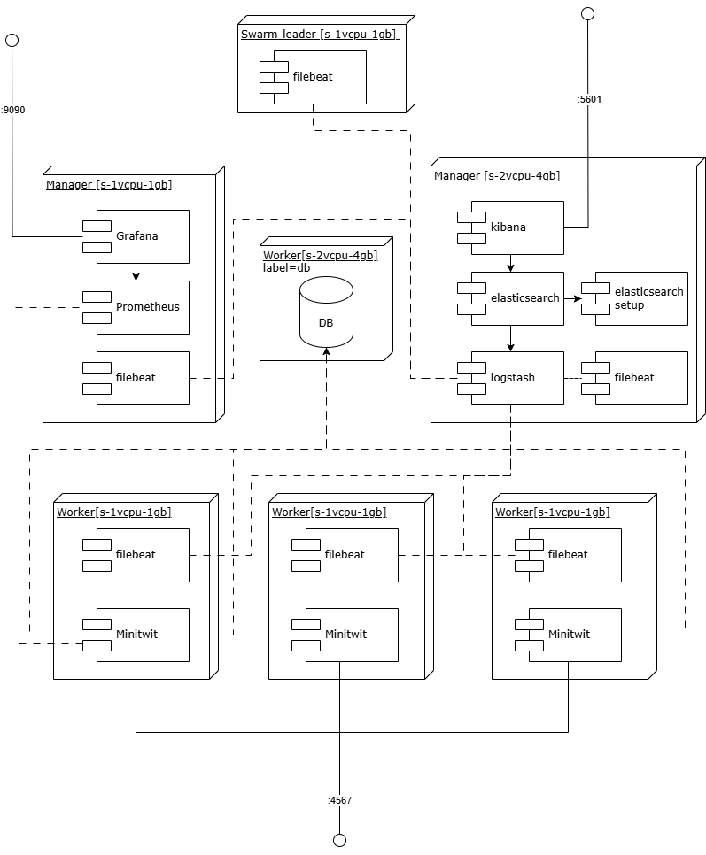

# Appendix
### [Seb/Nick] Repo settings. Workflows on merge. Require 1 team member on pull requests.

This section is also described in the Process Section

To support and enforce the development workflow of new features as explained in [Process Section](3-process.md) we have setup branch protection rules via Github. For the `main` and `develop` branch the rules are:  
 
1. No direct merge into protected branch.
2. Changes must be approved by at least team member
3. Workflows and test must pass

This ensures that all changes to the protected branches have been approved and tested.

## CI/CD Pipeline

In the following section, we will discuss the CI/CD pipeline of our system, and for this, we discuss two key branches: `main` and `develop`. The `main` branch includes the code running on our production environment, and `develop` branch includes the code running on our staging environment. For the sake of communication, we will simply address these branches by `production` and `staging`.

We use GitHub for handling our repository and tracking the process with their issue system. We use a branching strategy, where features written in issues are worked on in `feature`-branches. Once ready, they are then merged into `staging` and then into `production`. This enables us to test and deploy the feature before production, at the cost of slightly longer delivery times. This means that for features to make it through to production, it includes three phases:

1. We work on the issue using a `feature`-branch. Developers work on and finalize the feature on this branch.
2. Once ready, a pull-request is created to merge the `feature`-branch into `staging`, where tests, linting, static code analysis and a fellow team member, must pass or approve the request, before being able to merge it into staging.
3. Once deployed to the staging environment, if the staging environment sees no failures and passes a manual test, a pull-request into `production` is made. Once approved by tests, linting, static code analysis and a fellow team member, the feature is pushed into main.

### [Seb/Nick] Development environemnt: local => branch => staging => production

As explain in the [Proceess section](3-process.md) when developing new features you branch off `develop` then implement the changes and test them **locally** via the local docker development environment `dovker-compose.dev.yml`. Then changes are pushed to a remote branch so another person can continue working on the changes. When the feature/tasks is completed a pull request is created. When the changes are approved they merge into `develop` and trigger a new deployment to the staging environment. If the changes work in the staging environment a pull request from `develop` into `main` can be created. Once the pull request is approved a new release and deployment to production is triggered.  

When developing new features you branch off `develop` then implement the changes and test them **locally** via the local docker development environment `dovker-compose.dev.yml`. Then changes are pushed to a remote branch so another person can continue working on the changes. When the feature/tasks is completed a pull request is created. When the changes are approved they merge into `develop` and trigger a new deployment to the staging environment. If the changes work in the staging environment a pull request from `develop` into `main` can be created. Once the pull request is approved a new release and deployment to production is triggered.  

## Issues and bugs

### [Seb/Nick] Returning wrong statuscode (Misalignment with simulation)

We implemented the simulator test in our testing workflow. It runs to ensure that the endpoints are available, works and return the correct status codes. After we had implemented the simulator test they failed and we realised that one of our enpoints was misaligned the specification. The endpoint returned the wrong status code. By implementing the simulator tests we discovered the issue in a very early stage.  

### [Seb/Nick] Stale ReadMe.md throughout project

Througout the project we have not always been the best to update the README.md, we have prioritized implementing the features for the deadline over the documentation. [Agile Manifesto: ](https://agilemanifesto.org/)*Working software over comprehensive documentation.*
Due to the features clogging up in staging we had plenty of problems to solve to get working software. 

### GitHub Actions as choice 

- Seamless integration into github
- Cost-Effective: It is free for open source project (3000 min pr month)
- Extensive Marketplace and Reusable Workflows
- Pre-Built Actions
- Reusable Workflows
- Scalability and Flexibility
- Supports Multiple Runners: Linux, macOS, and Windows
- Highly Customizable Workflows: You can define the workflows in YAML files
- Built-in Security Features
- GitHub Actions provides secrets management, role-based access control
- Parallel Execution: Supports matrix builds and parallel jobs, reducing build and deployment time
- Tight GitHub Integration: Workflows can trigger on pull requests, pushes, issue comments, and other GitHub events, enabling efficient automation.

### Ideal Architecture
The ideal architecture with less pressure on the swarm leader node. 

## Choosing technologies

### Progamming Language and Web Framework
- **C# + Razor-Pages**
  - Familiarity with both the language and framework
  - Big enterprise standard
  - Enterprise-grade software
  - Very popular in Denmark
  - Verbose + A lot of boilerplate
  - Compiled => faster execution
  - Founded by Microsoft (Trustworthy)
- **Ruby + Sinatra**
  - No familiarity
  - **Interesting (to learn new technologies)**
  - Lighter than Go
  - **Very readable & learnable**
  - **Rapid development**
  - Interpreted => Slower
    - Reports of lower scalability
- **Go + Gorilla**
  - Compiled => Faster
  - Great for concurrency
  - Not designed for web applications
    - Reports of longer development time
  - More low-level features (e.g. pointers)
  - DevOps => popular for microservices
  - Founded by Google (Trustworthy)

We chose Ruby + Sinatra because of the readibility and learnability.

It allows us to do rapid development.

We also find it interesting to learn new technologies.

### Database
- **SQLite**
  - SQLite locks during writes
  - Does not scale as well
  - Great for development
- **MySQL**
  - Simpler feature set
  - Industry standard
  - Great for large amount of reads
  - Oracle owned
- **PostgresQL**
  - Advanced query features
  - Industry standard
  - Open-source

### E2E Testing
Playwright launches browsers faster and runs tests in parallel by default.Headless mode is optimized, leading to faster execution times compared to Selenium.

Auto-waiting for elements prevents flaky tests, whereas Selenium often requires explicit waits.

Supports multiple browsers out of the box:
Playwright works natively with Chromium, Firefox, and WebKit (Safari engine)

Architecture: Playwright uses a WebSocket connection rather than the WebDriver API and HTTP. This stays open for the duration of the test, so everything is sent on one connection. This is one reason why Playwright’s execution speeds tend to be faster.

History: Playwright is fairly new to the automation scene. It is faster than Selenium and has capabilities that Selenium lacks, but it does not yet have as broad a range of support for browsers/languages or community support. It is open source and [backed by Microsoft](https://github.com/microsoft/playwright).

While newer and with less community support, it offers modern features and performance advantages. We tried to implement both Selenium and Playwrigt, the Selenium was difficult to implement due the the required browser executables. Playwright was easier to setup and develop. So that became our choice for E2E tests. More info in Appendix.

### Unit testing
- **Minitest**
  - Built-in
  - Often standard in web frameworks
  - Very light and efficient
- **RSpec**
  - Very readable DSL
  - Very popular alternative to minitest
  - Large toolkit

### Deployment
- **Digital Ocean**
  - **focuses on simplicity**
  - **easy to learn CLI/interface**
  - **great tooling**
  - sufficient credits to cover our needs
- **AWS**/**Microsoft Azure**
  - industry leading, popular
  - customizability
  - steeper learning curve
  - more enterprise focused